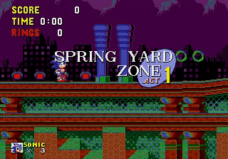

# Experiments for OpenAI Retro Contest

### Summary
The [OpenAI Retro Contest](https://contest.openai.com/) was an opportunity to use the new [Retro](https://github.com/openai/retro) environment to test transfer learning for reinforcement learning algorithms.

I spent most of my time outside of work and sleep during May of 2018 tinkering with algorithms for the contest. This repo holds code that I used for my experiments, so could be used as a starting point for exploring some of the ideas further.

### Algorithms
The contest came with a set of [baseline](https://github.com/openai/retro-baselines) implementations. My work was all influenced by these baselines.

The three baseline implementations are:

#### Rainbow
Rainbow is a Deep Q-Learning (DQN) algorithm I have seen described as a "kitchen sink" approach: it combines a variety of techniques used to improve DQN results together into a high-performing whole. [Q-Learning](https://en.wikipedia.org/wiki/Q-learning) algorithms attempt to maximize future _reward_ by learning from past experience. "Q" represents the function that returns the reward based on an action. Honestly, it's an awkward name, but... whatever. "Deep" Q-Learning approximates the Q function using a neural network. For more information about Rainbow, the original paper is on [Arxiv](https://arxiv.org/abs/1710.02298).

#### PPO2
[PPO2](https://blog.openai.com/openai-baselines-ppo/) is a high-performing policy gradient algorithm. Instead of optimizing the _reward_ per-action, as DQN algorithms do, policy gradient algorithms optimize an explicit _policy_ mapping the state observed to an action. The policy is iteratively improved during training to take actions that lead to a higher reward. PPO (and the extension, PPO2) uses a clever clipping approach to prevent dramatic updates to the policy while also avoiding expensive calculation, allowing for stable and efficient training.

#### JERK (Just Enough Retained Knowledge) 
[JERK])https://arxiv.org/abs/1804.03720) is an algorithm introduced as part of the retro contest. The idea is simple: try random sequences of runs and jumps, and replay the sequenced with highest reward as the contest time limot approaches. In a predictable environment, JERK could eventually achieve perfect performance. The restro contest randomizes the number of steps an action is applied, so a fixed sequence is likely to derail over time.

Another algorithm is worth mentioning.
#### Evolution Strategies
Evolution Strategies, unlike the baseline algorithms, explores by making random changes to the policy rather than taking randim actions. It is typically slow abd inefficient, but can be massively parallelized across multiple processors snd machines. I explored using Evolution Strategies to find good weights for just the flat layer of my PPO2 policy after pretraining the convolutional layers. I think that the approach has a lot of promise, but I do not currently have access to sufficient compute resources to find a good policy in a reasonable amount of time (less than weeks or months).

### Results Summary
tl;dr: Pretrained Rainbow works best, but a JERK/PPO2 hybrid with LSH memory came close.

